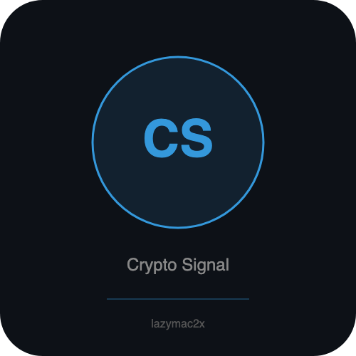

<p align="center"></p>

[](https://lazymac2x.github.io/lazymac-api-store/) [](https://coindany.gumroad.com/) [](https://mcpize.com/mcp/crypto-signal-api)

# crypto-signal-api

[](https://www.npmjs.com/package/@lazymac/mcp)
[](https://smithery.ai/server/lazymac/mcp)
[](https://coindany.gumroad.com/l/zlewvz)
[](https://api.lazy-mac.com)

> 🚀 Want all 42 lazymac tools through ONE MCP install? `npx -y @lazymac/mcp` · [Pro $29/mo](https://coindany.gumroad.com/l/zlewvz) for unlimited calls.

Real-time cryptocurrency trading signals powered by technical analysis. Fetches live data from Binance and computes RSI, MACD, EMA, Bollinger Bands, Stochastic RSI, ATR, and volume analysis to generate actionable BUY/SELL/HOLD signals.

**No API key required** — uses Binance public market data.

## Quick Start

```bash
npm install
npm start        # REST API on http://localhost:3100
npm run mcp      # MCP server (stdio, for AI agents)
```

## REST API Endpoints

### `GET /api/v1/signal/:symbol`
Combined trading signal with full indicator breakdown.

```bash
curl http://localhost:3100/api/v1/signal/BTCUSDT
curl http://localhost:3100/api/v1/signal/ETHUSDT?interval=4h
```

**Response:**
```json
{
  "symbol": "BTCUSDT",
  "interval": "1h",
  "signal": {
    "action": "BUY",
    "strength": "moderate",
    "confidence": 58,
    "score": 4,
    "details": [...]
  },
  "indicators": {
    "price": 87250.50,
    "rsi": 35.2,
    "macd": { "MACD": -120.5, "signal": -95.3, "histogram": -25.2 },
    "ema": { "ema9": 87100, "ema21": 87400, "ema50": 88200 },
    "bollingerBands": { "upper": 89500, "middle": 87800, "lower": 86100 },
    "stochRsi": { "k": 15.3, "d": 18.7 },
    "atr": 850.5,
    "volume": { "current": 1250.5, "average": 980.3, "ratio": 1.28 }
  }
}
```

### `GET /api/v1/indicators/:symbol`
Technical indicators only (no signal).

### `GET /api/v1/candles/:symbol`
Raw OHLCV candle data.

| Param | Default | Description |
|-------|---------|-------------|
| `interval` | `1h` | `1m, 5m, 15m, 1h, 4h, 1d` |
| `limit` | `100` | Max 500 |

### `GET /api/v1/screener`
Scan top coins by volume with signals for each.

```bash
curl http://localhost:3100/api/v1/screener?limit=10&interval=4h
```

## MCP Server (for AI Agents)

Run as an MCP tool server over stdio:

```bash
node src/mcp-server.js
```

### Available Tools

| Tool | Description |
|------|-------------|
| `get_crypto_signal` | Trading signal + indicators for a pair |
| `get_crypto_indicators` | Detailed technical indicators |
| `screen_crypto_market` | Scan top coins with signals |

### Claude Desktop Config

```json
{
  "mcpServers": {
    "crypto-signals": {
      "command": "node",
      "args": ["/path/to/crypto-signal-api/src/mcp-server.js"]
    }
  }
}
```

## Signal Logic

| Score | Action | Strength |
|-------|--------|----------|
| ≥ +4 | STRONG_BUY | strong |
| +2 to +3 | BUY | moderate |
| -1 to +1 | HOLD | weak |
| -2 to -3 | SELL | moderate |
| ≤ -4 | STRONG_SELL | strong |

Indicators scored: RSI, MACD histogram, EMA alignment, Bollinger Band position, Stochastic RSI, Volume ratio.

## License

MIT

## Related projects

- 🧰 **[lazymac-mcp](https://github.com/lazymac2x/lazymac-mcp)** — Single MCP server exposing 15+ lazymac APIs as tools for Claude Code, Cursor, Windsurf
- ✅ **[lazymac-api-healthcheck-action](https://github.com/lazymac2x/lazymac-api-healthcheck-action)** — Free GitHub Action to ping any URL on a cron and fail on non-2xx
- 🌐 **[api.lazy-mac.com](https://api.lazy-mac.com)** — 36+ developer APIs, REST + MCP, free tier

<sub>💡 Host your own stack? <a href="https://m.do.co/c/c8c07a9d3273">Get $200 DigitalOcean credit</a> via lazymac referral link.</sub>
